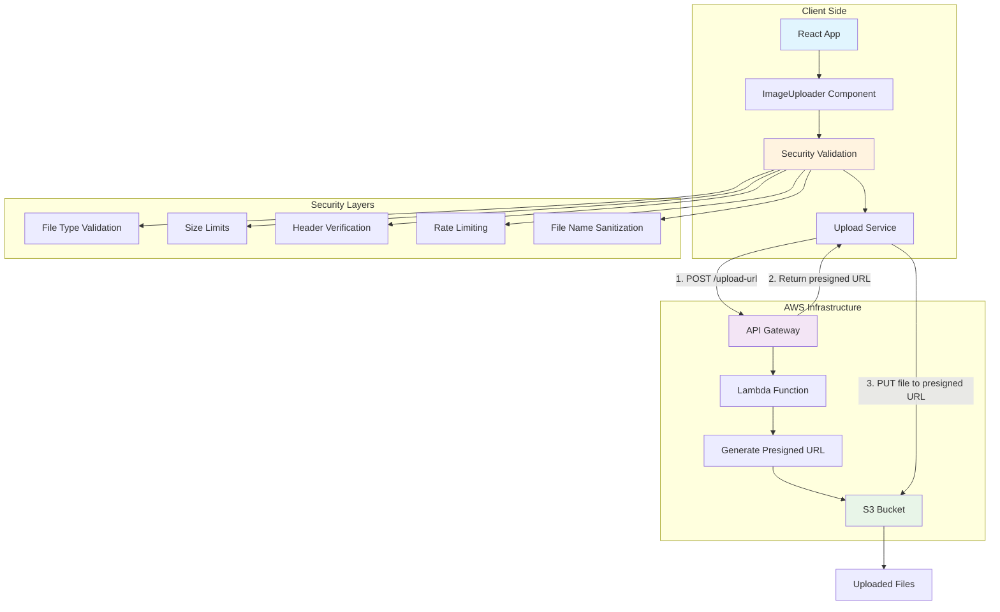
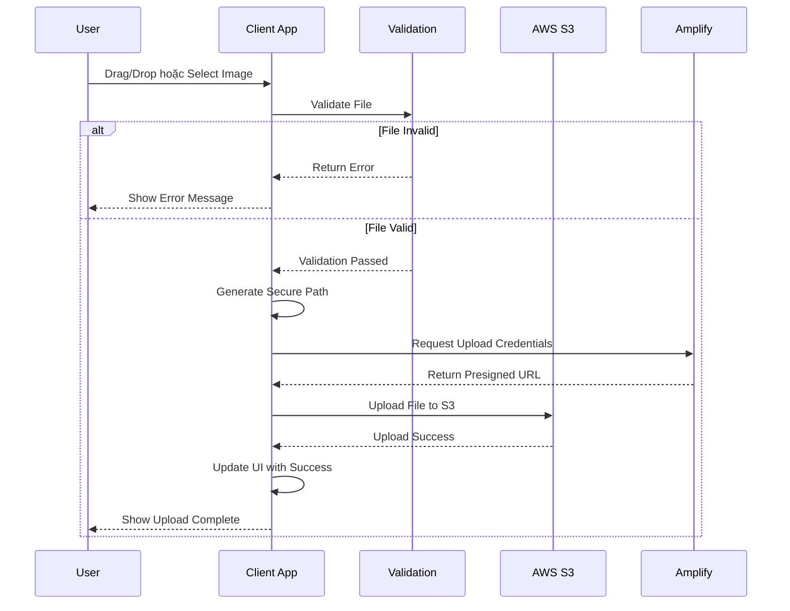

# AWS S3 File Upload Widget

Ứng dụng upload file hiện đại và bảo mật lên Amazon S3 sử dụng React, TypeScript, Vite và AWS API Gateway.

## 🚀 Tính năng chính

- ✅ **Drag & Drop Interface**: Giao diện kéo thả trực quan
- ✅ **Click to Upload**: Fallback cho việc chọn file thủ công  
- ✅ **Security First**: Validation toàn diện, kiểm tra file header, rate limiting
- ✅ **Modern UI**: Giao diện đơn giản, dễ sử dụng
- ✅ **Real-time Status**: Hiển thị trạng thái upload theo thời gian thực
- ✅ **File Management**: Theo dõi các file đã upload
- ✅ **AWS S3 Integration**: Upload trực tiếp lên Amazon S3 qua presigned URL

## 🛠️ Tech Stack

- **Frontend**: React 18 + TypeScript
- **Build Tool**: Vite
- **Styling**: Tailwind CSS + Inline Styles
- **File Upload**: react-dropzone
- **Backend**: AWS API Gateway + Lambda
- **Storage**: Amazon S3
- **Authentication**: Presigned URL (không cần authentication)

## 📋 Yêu cầu hệ thống

- Node.js >= 18.0.0
- npm >= 8.0.0

## 🔧 Cài đặt và thiết lập

### 1. Clone và cài đặt dependencies

```bash
git clone <repository-url>
cd aws-s3-file-uploader
npm install
```

### 2. Chạy ứng dụng development

```bash
npm run dev
```

Ứng dụng sẽ chạy tại `http://localhost:5173`

### 3. Cấu hình API endpoint (nếu cần)

Mở file `src/services/uploadService.ts` và cập nhật `API_BASE_URL`:

```typescript
const API_BASE_URL = 'https://your-api-gateway-url.amazonaws.com';
```

## 🏗️ Kiến trúc hệ thống



## 📊 Luồng upload ảnh



## 🔒 Các biện pháp bảo mật

### 1. File Validation
- **MIME Type Check**: Kiểm tra loại file dựa trên MIME type
- **Extension Validation**: Xác thực phần mở rộng file
- **Header Verification**: Kiểm tra file signature để phòng chống file giả mạo
- **Size Limits**: Giới hạn kích thước file (mặc định 10MB)

### 2. File Name Security
- **Path Traversal Protection**: Ngăn chặn `../` attacks
- **Invalid Character Filtering**: Loại bỏ ký tự không hợp lệ
- **Reserved Name Check**: Kiểm tra tên file hệ thống
- **Sanitization**: Tự động sanitize tên file

### 3. Rate Limiting
- **Upload Limits**: Giới hạn số lượng upload (10 files/phút)
- **Client-side Tracking**: Theo dõi và kiểm soát tần suất upload

### 4. AWS S3 Security
- **Bucket Policies**: Cấu hình quyền truy cập hạn chế
- **CORS Configuration**: Cấu hình CORS an toàn
- **Presigned URLs**: Sử dụng temporary credentials
- **Metadata Tracking**: Lưu trữ metadata cho audit trail

## 📁 Cấu trúc project

```
src/
├── components/           # React components
│   ├── ImageUploader.tsx # Component upload chính
│   └── Header.tsx        # Header component
├── utils/               # Utility functions
│   └── security.ts      # Security validation utilities
├── App.tsx             # Main app component
├── main.tsx            # Entry point
└── index.css           # Global styles

amplify/
├── backend.ts          # Amplify backend configuration
├── auth/               # Authentication configuration
├── data/               # Data/API configuration
└── storage/            # S3 storage configuration

public/                 # Static assets
```

## ⚙️ Configuration

### Security Configuration

```typescript
const securityConfig = {
  maxFileSize: 10 * 1024 * 1024, // 10MB
  allowedMimeTypes: ['image/jpeg', 'image/png', 'image/gif', 'image/webp'],
  allowedExtensions: ['.jpg', '.jpeg', '.png', '.gif', '.webp'],
  maxFilesPerUpload: 5,
};
```

### Upload Configuration

```typescript
const uploadConfig = {
  maxConcurrentUploads: 3,
  retryAttempts: 2,
  timeoutDuration: 30000, // 30 seconds
};
```

## 🎨 Customization

### Thay đổi theme colors

Chỉnh sửa `tailwind.config.js`:

```javascript
theme: {
  extend: {
    colors: {
      primary: {
        50: '#f0f9ff',
        500: '#3b82f6',
        600: '#2563eb',
      }
    }
  }
}
```

### Tùy chỉnh security rules

Chỉnh sửa `src/utils/security.ts` để thay đổi các quy tắc validation.

## 🚀 Deployment

### Development
```bash
npm run dev
```

### Production Build
```bash
npm run build
npm run preview
```

### Deploy to AWS
```bash
amplify publish
```

## 📱 Responsive Design

Ứng dụng được thiết kế responsive và hoạt động tốt trên:
- 📱 Mobile devices (320px+)
- 📟 Tablets (768px+)  
- 💻 Desktop (1024px+)
- 🖥️ Large screens (1280px+)

## 🔧 Troubleshooting

### Common Issues

1. **Upload fails with CORS error**
   - Kiểm tra CORS configuration trong S3 bucket
   - Verify Amplify storage configuration

2. **File validation fails**
   - Kiểm tra file type và size
   - Verify security configuration

3. **Rate limiting triggered**
   - Đợi 1 phút trước khi upload tiếp
   - Giảm số lượng file upload cùng lúc

## 📊 Performance

- **Bundle Size**: ~2.5MB (gzipped)
- **Initial Load**: <3 seconds
- **Upload Speed**: Phụ thuộc vào kết nối mạng và kích thước file
- **Concurrent Uploads**: Hỗ trợ up to 5 files đồng thời

## 🤝 Contributing

1. Fork repository
2. Tạo feature branch (`git checkout -b feature/AmazingFeature`)
3. Commit changes (`git commit -m 'Add some AmazingFeature'`)
4. Push to branch (`git push origin feature/AmazingFeature`)
5. Tạo Pull Request

## 📄 License

Dự án này được phân phối dưới MIT License. Xem `LICENSE` file để biết thêm chi tiết.

## 🆘 Support

Nếu bạn gặp vấn đề hoặc có câu hỏi:

1. Kiểm tra [Issues](../../issues) để xem đã có ai gặp vấn đề tương tự chưa
2. Tạo issue mới với mô tả chi tiết
3. Gửi email support (nếu có)

## 🔮 Roadmap

- [ ] Image preview và cropping
- [ ] Batch upload với progress bar
- [ ] Image optimization tự động
- [ ] Folder organization
- [ ] User authentication và private uploads
- [ ] Image CDN integration
- [ ] Advanced image filters
- [ ] API key management interface

---

**Built with ❤️ using React, TypeScript, AWS Amplify và Vite**