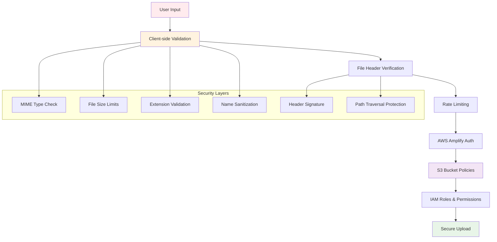

# Security Documentation - AWS S3 Image Uploader

## 🔐 Tổng quan về bảo mật

Ứng dụng AWS S3 Image Uploader được thiết kế với nhiều lớp bảo mật để đảm bảo an toàn cho dữ liệu và hệ thống. Document này mô tả chi tiết các biện pháp bảo mật đã được implement.

## 🛡️ Kiến trúc bảo mật



## 🔍 Client-side Security

### 1. File Validation

#### MIME Type Verification
```typescript
const allowedMimeTypes = [
  'image/jpeg',
  'image/png', 
  'image/gif',
  'image/webp'
];

if (!allowedMimeTypes.includes(file.type)) {
  throw new Error('Invalid file type');
}
```

#### File Extension Check
```typescript
const allowedExtensions = ['.jpg', '.jpeg', '.png', '.gif', '.webp'];
const fileName = file.name.toLowerCase();
const hasValidExtension = allowedExtensions.some(ext => 
  fileName.endsWith(ext.toLowerCase())
);
```

#### File Size Limits
```typescript
const MAX_FILE_SIZE = 10 * 1024 * 1024; // 10MB
if (file.size > MAX_FILE_SIZE) {
  throw new Error('File too large');
}
```

### 2. File Header Verification

Kiểm tra file signature để phòng chống file giả mạo:

```typescript
const signatures = {
  jpeg: [0xFF, 0xD8, 0xFF],
  png: [0x89, 0x50, 0x4E, 0x47, 0x0D, 0x0A, 0x1A, 0x0A],
  gif: [0x47, 0x49, 0x46, 0x38],
  webp: [0x52, 0x49, 0x46, 0x46]
};
```

### 3. File Name Security

#### Path Traversal Protection
```typescript
// Ngăn chặn ../../../etc/passwd
if (fileName.includes('../') || fileName.includes('..\\')) {
  throw new Error('Path traversal detected');
}
```

#### Invalid Character Filtering
```typescript
const invalidChars = /[<>:""|?*\x00-\x1f]/;
if (invalidChars.test(fileName)) {
  throw new Error('Invalid characters in filename');
}
```

#### Reserved Names Check
```typescript
const reservedNames = ['CON', 'PRN', 'AUX', 'NUL', 'COM1', 'LPT1'];
const nameWithoutExt = fileName.split('.')[0].toUpperCase();
if (reservedNames.includes(nameWithoutExt)) {
  throw new Error('Reserved filename');
}
```

### 4. Rate Limiting

```typescript
class UploadRateLimiter {
  private uploads: number[] = [];
  private readonly maxUploads = 10;
  private readonly timeWindow = 60000; // 1 minute
  
  canUpload(): boolean {
    const now = Date.now();
    this.uploads = this.uploads.filter(
      timestamp => now - timestamp < this.timeWindow
    );
    return this.uploads.length < this.maxUploads;
  }
}
```

## ☁️ AWS Infrastructure Security

### 1. IAM Permissions

#### Minimum Required Permissions
```json
{
  "Version": "2012-10-17",
  "Statement": [
    {
      "Effect": "Allow",
      "Action": [
        "s3:PutObject",
        "s3:PutObjectAcl"
      ],
      "Resource": "arn:aws:s3:::your-bucket/images/*"
    },
    {
      "Effect": "Allow", 
      "Action": [
        "s3:GetObject"
      ],
      "Resource": "arn:aws:s3:::your-bucket/images/*"
    }
  ]
}
```

#### Guest User Permissions
```json
{
  "Version": "2012-10-17",
  "Statement": [
    {
      "Effect": "Allow",
      "Action": [
        "s3:PutObject"
      ],
      "Resource": "arn:aws:s3:::your-bucket/images/*",
      "Condition": {
        "StringLike": {
          "s3:x-amz-content-sha256": "*"
        }
      }
    }
  ]
}
```

### 2. S3 Bucket Security

#### Bucket Policy
```json
{
  "Version": "2012-10-17",
  "Statement": [
    {
      "Sid": "AllowAmplifyUpload",
      "Effect": "Allow",
      "Principal": {
        "AWS": "arn:aws:iam::ACCOUNT:role/amplify-*"
      },
      "Action": [
        "s3:PutObject",
        "s3:PutObjectAcl"
      ],
      "Resource": "arn:aws:s3:::bucket-name/images/*"
    },
    {
      "Sid": "DenyInsecureConnections",
      "Effect": "Deny",
      "Principal": "*",
      "Action": "s3:*",
      "Resource": [
        "arn:aws:s3:::bucket-name",
        "arn:aws:s3:::bucket-name/*"
      ],
      "Condition": {
        "Bool": {
          "aws:SecureTransport": "false"
        }
      }
    }
  ]
}
```

#### CORS Configuration
```json
[
  {
    "AllowedHeaders": [
      "*"
    ],
    "AllowedMethods": [
      "PUT",
      "POST"
    ],
    "AllowedOrigins": [
      "https://yourdomain.com",
      "http://localhost:5173"
    ],
    "ExposeHeaders": [
      "ETag"
    ],
    "MaxAgeSeconds": 3000
  }
]
```

### 3. Encryption

#### Server-Side Encryption
```typescript
const uploadOptions = {
  contentType: file.type,
  metadata: {
    'x-amz-server-side-encryption': 'AES256'
  }
};
```

#### In-Transit Encryption
- Tất cả requests đều sử dụng HTTPS
- TLS 1.2+ required
- Certificate validation enforced

## 🔒 Data Protection

### 1. Metadata Security

Thông tin metadata được lưu trữ an toàn:

```typescript
const metadata = {
  originalName: sanitizeFileName(file.name),
  uploadedBy: 'anonymous',
  uploadedAt: new Date().toISOString(),
  fileSize: file.size.toString(),
  securityValidated: 'true',
  clientIP: 'masked', // IP được mask để bảo vệ privacy
  userAgent: 'masked'  // User agent được mask
};
```

### 2. File Path Security

```typescript
function generateSecureUploadPath(fileName: string): string {
  const timestamp = Date.now();
  const randomId = crypto.randomUUID();
  const sanitizedName = sanitizeFileName(fileName);
  
  // Tạo path có cấu trúc: images/timestamp-uuid-filename
  return `images/${timestamp}-${randomId}-${sanitizedName}`;
}
```

### 3. Content Validation

```typescript
// Validate image content beyond headers
const validateImageContent = async (file: File): Promise<boolean> => {
  return new Promise((resolve) => {
    const img = new Image();
    img.onload = () => resolve(true);
    img.onerror = () => resolve(false);
    img.src = URL.createObjectURL(file);
  });
};
```

## 🚨 Threat Mitigation

### 1. Malware Upload Prevention

- **File signature verification**: Kiểm tra magic bytes
- **Content-type validation**: So sánh MIME type với extension
- **Size limits**: Ngăn chặn DoS qua large files
- **Rate limiting**: Ngăn chặn spam uploads

### 2. Path Traversal Prevention

```typescript
// Sanitize file names
function sanitizeFileName(fileName: string): string {
  return fileName
    .replace(/[<>:""|?*\x00-\x1f]/g, '_')  // Replace invalid chars
    .replace(/\.\./g, '_')                 // Remove directory traversal
    .replace(/^\.+/, '')                   // Remove leading dots
    .replace(/\.+$/, '')                   // Remove trailing dots
    .substring(0, 255);                    // Limit length
}
```

### 3. Injection Attack Prevention

- **Input sanitization**: Tất cả input đều được sanitize
- **No script execution**: Files chỉ được store, không execute
- **Metadata filtering**: Metadata được filter để loại bỏ script

### 4. DoS Attack Mitigation

- **Rate limiting**: 10 uploads per minute per client
- **File size limits**: Maximum 10MB per file
- **Concurrent upload limits**: Maximum 5 concurrent uploads
- **Session limits**: Timeout cho inactive sessions

## 📊 Security Monitoring

### 1. Logging

```typescript
const securityLogger = {
  logUploadAttempt: (fileName: string, size: number, result: string) => {
    console.log(`[SECURITY] Upload attempt: ${fileName}, Size: ${size}, Result: ${result}`);
  },
  
  logValidationFailure: (fileName: string, reason: string) => {
    console.warn(`[SECURITY] Validation failed: ${fileName}, Reason: ${reason}`);
  },
  
  logRateLimitExceeded: (clientId: string) => {
    console.warn(`[SECURITY] Rate limit exceeded for client: ${clientId}`);
  }
};
```

### 2. Metrics Tracking

- Upload success/failure rates
- File type distribution
- Size distribution
- Rate limiting events
- Validation failures

### 3. Alerting

```typescript
const securityAlerts = {
  suspiciousActivity: (details: any) => {
    // Send alert to monitoring system
    if (details.failureRate > 50) {
      sendAlert('High failure rate detected', details);
    }
  },
  
  malwareDetected: (fileName: string) => {
    sendCriticalAlert('Potential malware upload', { fileName });
  }
};
```

## 🔧 Security Configuration

### Environment Variables

```bash
# Security settings
VITE_MAX_FILE_SIZE=10485760          # 10MB
VITE_MAX_FILES_PER_UPLOAD=5
VITE_RATE_LIMIT_WINDOW=60000         # 1 minute
VITE_RATE_LIMIT_MAX_UPLOADS=10

# AWS settings
VITE_AWS_REGION=us-east-1
VITE_S3_BUCKET_NAME=your-secure-bucket

# Debug settings (development only)
VITE_SECURITY_DEBUG=false
VITE_LOG_SECURITY_EVENTS=true
```

### Runtime Configuration

```typescript
interface SecurityConfig {
  maxFileSize: number;
  allowedMimeTypes: string[];
  allowedExtensions: string[];
  maxFilesPerUpload: number;
  enableHeaderValidation: boolean;
  enableRateLimit: boolean;
  logSecurityEvents: boolean;
}

const productionSecurityConfig: SecurityConfig = {
  maxFileSize: 10 * 1024 * 1024,
  allowedMimeTypes: ['image/jpeg', 'image/png', 'image/gif', 'image/webp'],
  allowedExtensions: ['.jpg', '.jpeg', '.png', '.gif', '.webp'],
  maxFilesPerUpload: 5,
  enableHeaderValidation: true,
  enableRateLimit: true,
  logSecurityEvents: true
};
```

## 🔄 Security Updates

### Regular Security Maintenance

1. **Dependency Updates**: Update packages thường xuyên
2. **Security Patches**: Apply security patches ngay lập tức
3. **Configuration Review**: Review security config hàng tháng
4. **Penetration Testing**: Test security định kỳ

### Security Checklist

- [ ] File validation đang hoạt động
- [ ] Rate limiting được enable
- [ ] HTTPS được force
- [ ] Bucket policies được cấu hình đúng
- [ ] IAM permissions tối thiểu
- [ ] Logging và monitoring hoạt động
- [ ] Dependencies được update
- [ ] Security headers được set

## 📞 Security Incident Response

### Trong trường hợp phát hiện security issue:

1. **Immediate Actions**:
   - Disable upload functionality
   - Block suspicious IPs
   - Preserve logs

2. **Investigation**:
   - Analyze logs
   - Identify scope of impact
   - Document findings

3. **Remediation**:
   - Apply fixes
   - Update security measures
   - Test thoroughly

4. **Recovery**:
   - Restore service
   - Monitor closely
   - Update documentation

---

**Security is everyone's responsibility! 🛡️**